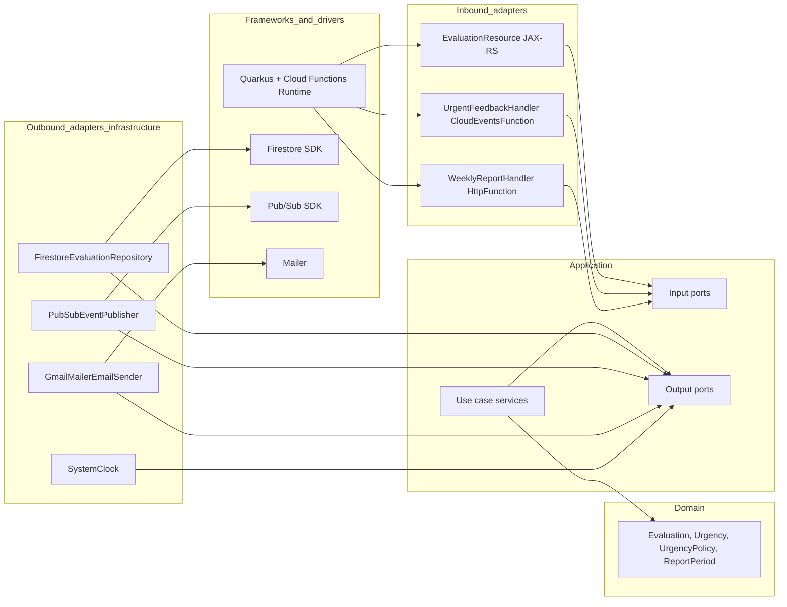

# Architecture

This document describes how the FIAP Phase 4 Feedback Platform is structured,
why each piece exists, and what the security boundaries look like.

## 1. Cloud model

Everything runs on **Google Cloud Platform**, using only managed/serverless
products so we pay-per-use and never run a server:

| Concern        | Service                  | Why                                                                                              |
| -------------- | ------------------------ | ------------------------------------------------------------------------------------------------ |
| Compute        | **Cloud Functions Gen2** | matches the brief's "funções serverless" wording; Gen2 runs on Cloud Run, scales to zero         |
| Persistence    | **Firestore (Native)**   | serverless NoSQL with a generous free tier; perfect for append-mostly evaluation documents       |
| Messaging      | **Pub/Sub**              | decouples the API from the notification flow; built-in retries and DLQ                           |
| Schedule       | **Cloud Scheduler**      | managed cron; invokes the report function with an OIDC token                                     |
| Secrets        | **Secret Manager**       | App Password + admin e-mail never leave the secret store, never enter git                        |
| Email          | **Gmail SMTP (587)**     | free, no third-party signup; GCP allows outbound port 587                                        |
| Observability  | **Cloud Logging + Monitoring** | structured JSON logs from Quarkus → Logging; built-in metrics → Monitoring → e-mail alerts |

The three Cloud Functions are independently deployable and follow the Single
Responsibility Principle — see section 3 for the function map.

## 2. Clean Architecture layout

The codebase is organized in four layers (dependencies always point **inward**):



Code lives in `common/src/main/java/com/fiap/feedback/`:

```
domain/                # Layer 1 — pure Java, no framework imports
  Evaluation, Urgency, UrgencyPolicy, ReportPeriod
application/
  port/in/             # input ports (use case interfaces)
    SubmitEvaluation, NotifyUrgentFeedback, GenerateWeeklyReport
  port/out/            # output ports
    EvaluationRepository, EventPublisher, EmailSender, Clock
  usecase/             # implementations of input ports — depend on output ports only
    SubmitEvaluationService, NotifyUrgentFeedbackService, GenerateWeeklyReportService
infrastructure/        # Layer 3 — outbound adapters wired by Quarkus CDI
  firestore/FirestoreEvaluationRepository
  pubsub/PubSubEventPublisher
  mail/GmailMailerEmailSender
  time/SystemClock
```

Function modules (`feedback-api`, `notification-handler`, `weekly-report`)
are nothing more than thin **inbound adapters**: they translate the
function-runtime input into a use-case command and ship the result back. No
Firestore, Pub/Sub, or e-mail code lives in those modules.

### Why this matters

- **Use cases are unit-testable with in-memory port fakes** — see
  `common/src/test/java/com/fiap/feedback/application/fakes/`. The full
  business behaviour is covered without any GCP emulator running.
- **Cloud migration is mechanical**: see
  [docs/portability-aws-azure.md](docs/portability-aws-azure.md).
- **A regression in an adapter (say, Firestore) cannot break the use case
  test suite** — the dependency direction makes that impossible.

## 3. Function map

| Function               | Trigger                        | Use case invoked          | Service account         | Permissions                                                          |
| ---------------------- | ------------------------------ | ------------------------- | ----------------------- | -------------------------------------------------------------------- |
| `feedback-api`         | HTTPS (public)                 | `SubmitEvaluation`        | `feedback-api-sa`       | `datastore.user`, `pubsub.publisher`, `secretmanager.secretAccessor` |
| `notification-handler` | Pub/Sub topic `urgent-feedback` | `NotifyUrgentFeedback`    | `notification-sa`       | `eventarc.eventReceiver`, `run.invoker`, `secretmanager.secretAccessor` |
| `weekly-report`        | HTTPS (private, OIDC only)     | `GenerateWeeklyReport`    | `report-sa`             | `datastore.viewer`, `secretmanager.secretAccessor`                   |

Each function is deployed by its own GitHub Actions workflow, can be
redeployed independently, and is wired to its own least-privileged service
account.

## 4. Domain rules

- A submitted evaluation must have a non-blank `descricao` (≤ 4000 chars)
  and a `nota` in `[0, 10]`. The rules are enforced in the
  `Evaluation` factory in the domain layer, so they cannot be bypassed by
  an inbound adapter or a future caller.
- `Urgency` is classified from `nota` by `UrgencyPolicy.classify`:
  - `nota ∈ [0, 3]` → `ALTA` (triggers an admin e-mail)
  - `nota ∈ [4, 6]` → `MEDIA`
  - `nota ∈ [7, 10]` → `BAIXA`

## 5. Security & governance

This is the bulk of the "configurações de segurança e governança" grading
criterion.

### Service accounts

Five service accounts, each scoped to the minimum it needs (see section 3
for per-function roles plus):

- **`scheduler-invoker-sa`** — only role: `run.invoker` on the
  `weekly-report` service. Cloud Scheduler uses this identity (with an
  OIDC token) to invoke the report function.
- **`github-deployer-sa`** — CI principal. Holds
  `roles/cloudfunctions.developer`, `roles/run.admin`,
  `roles/iam.serviceAccountUser`, `roles/storage.admin`, and
  `roles/artifactregistry.admin`. A JSON key for this SA is the only thing
  in `GCP_SA_KEY` GitHub secret.

Inspect the live IAM bindings with:

```bash
gcloud projects get-iam-policy $PROJECT_ID --format='table(bindings.role,bindings.members)'
```

### Public surface

Only **`feedback-api`** is publicly callable (`--allow-unauthenticated`).

- The notification handler is Pub/Sub-triggered via Eventarc — no public
  URL at all.
- The weekly-report function is deployed `--no-allow-unauthenticated` and
  IAM-restricted to `scheduler-invoker-sa`. To invoke it manually you
  must mint an OIDC token with `gcloud auth print-identity-token`.

### Secrets

Three secrets live in Secret Manager:

- `gmail-username` — sender Gmail address
- `gmail-app-password` — 16-char App Password (2-Step Verification required)
- `admin-email` — recipient for urgent notifications and weekly reports

They are injected as env vars at deploy time via:

```
--set-secrets="GMAIL_USERNAME=gmail-username:latest,..."
```

Nothing sensitive ever lands in source or in container images.

### Why a service-account key for CI (vs Workload Identity Federation)

Workload Identity Federation is more secure (no key to rotate or leak) but
adds 30 minutes of fiddly setup. For a graded demo project running on
rotating FIAP credits, a tightly scoped SA key stored as a GitHub secret is
a pragmatic trade-off. The `github-deployer-sa` only has
deployment-related roles, no Firestore access, no Secret Manager admin.

## 6. CI/CD

Three workflows under `.github/workflows/`, one per function. Each is
triggered by `push` to `main` filtered by `paths:` so a change to the API
only redeploys the API. Each workflow:

1. Sets up Temurin JDK 21 with cached Maven repository.
2. Builds the function JAR via `./mvnw -pl <module> -am package -DskipTests`.
3. Authenticates to GCP with `google-github-actions/auth@v2` using the
   `GCP_SA_KEY` secret.
4. Deploys via `gcloud functions deploy ... --gen2 --runtime=java21`.

The `deploy-api` workflow exposes a `workflow_dispatch` input
`min_instances` (choices `0` or `1`) so you can warm up the API for the
demo video and then scale back to zero.

The `deploy-report` workflow also creates/updates the Cloud Scheduler job
that triggers it weekly.

## 7. Observability

- **Logging**: Quarkus's `quarkus-logging-json` extension emits structured
  JSON log lines that Cloud Logging parses into searchable fields
  automatically. Use cases log their key events (persisted ID, published
  message ID, sent e-mail).
- **Metrics**: Cloud Functions Gen2 emits request count, latency, error
  rate, and active instance count out of the box.
- **Alerts**: `infra/monitoring/alert-policies.json` defines three
  policies (one per function) that page the configured e-mail channel on
  5xx error rate > 0 over 5 min.
- **Dashboard**: `infra/monitoring/dashboard.json` plots request rate,
  errors, p95 latency, and instance count for all three functions.

Apply both via `gcloud monitoring ...` — the commands are in the next
section.

## 8. How to apply monitoring policies (once the channel exists)

```bash
# Get the notification channel ID created by setup.sh
CHANNEL=$(gcloud alpha monitoring channels list \
  --filter='type=email' --format='value(name)' | head -n1)

# Substitute it into the policy file and create each policy
jq --arg ch "$CHANNEL" \
   '.policies[] | .notificationChannels |= [$ch]' \
   infra/monitoring/alert-policies.json \
   | while read -r policy; do
       echo "$policy" | gcloud alpha monitoring policies create --policy-from-file=-
     done

# Import the dashboard
gcloud monitoring dashboards create --config-from-file=infra/monitoring/dashboard.json
```

## 9. Cost expectations

With `--min-instances=0` the entire stack costs **less than 1 USD/month**
for the demo scenario (a few requests per day plus one weekly job). The
Firestore free tier covers the load. The biggest cost vector is leaving
`--min-instances=1` on for an extended time — about $0.10/hour — so make
sure to flip it back to `0` after recording the video.
