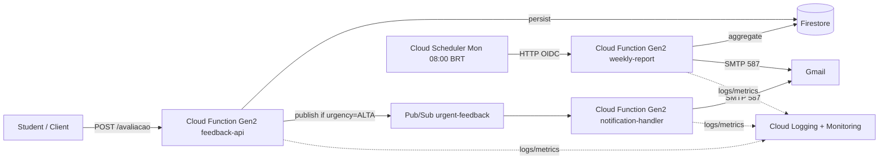

# FIAP Tech Challenge — Phase 4

Serverless feedback platform for online courses, built for the FIAP Phase 4
Tech Challenge. Students submit evaluations through a public HTTP endpoint;
the platform stores them, alerts admins by e-mail when a rating is critical,
and sends a weekly aggregated report.

- **Cloud:** Google Cloud Platform
- **Runtime:** Cloud Functions Gen 2 (HTTP + Pub/Sub triggers)
- **Language:** Java 21 + Quarkus 3.20
- **Architecture:** Clean Architecture (domain / application / infrastructure)
- **Storage:** Firestore (Native mode)
- **Messaging:** Pub/Sub
- **Email:** Gmail SMTP via `quarkus-mailer`
- **Scheduler:** Cloud Scheduler (Mon 08:00 BRT)
- **IaC:** a single `gcloud` script (`infra/setup.sh`)
- **CI/CD:** GitHub Actions

## Quick links

- [ARCHITECTURE.md](ARCHITECTURE.md) — architecture, layers, security, IAM
- [docs/demo-script.md](docs/demo-script.md) — recording the demo video
- [docs/portability-aws-azure.md](docs/portability-aws-azure.md) — what would change to move to AWS or Azure
- [docs/openapi.yaml](docs/openapi.yaml) — API contract
- [docs/postman/](docs/postman/) — Postman collection + environment

## Architecture at a glance



## Repository layout

```
.
├── common/                  # domain + application + infrastructure layers
├── feedback-api/            # Cloud Function Gen2 (HTTP) — inbound adapter
├── notification-handler/    # Cloud Function Gen2 (Pub/Sub) — inbound adapter
├── weekly-report/           # Cloud Function Gen2 (HTTP) — inbound adapter
├── infra/                   # gcloud provisioning + monitoring
├── .github/workflows/       # CI/CD per function
├── docs/                    # OpenAPI, Postman, demo, portability appendix
└── docker-compose.yml       # Firestore + Pub/Sub emulators for local dev
```

## Local development

Prerequisites: JDK 21+ and Docker. (If you hit
`permission denied while trying to connect to the docker API` on Linux,
add yourself to the `docker` group:
`sudo usermod -aG docker $USER && newgrp docker`.)

```bash
# 1. Start the Firestore + Pub/Sub emulators and seed the urgent-feedback topic
docker compose up -d

# 2. Run the API in Quarkus dev mode (auto-wires to the emulators via %dev config)
./mvnw -pl feedback-api -am quarkus:dev
```

That's it — no env vars to export. The `%dev.*` block in each module's
`application.properties` points the GCP client at `localhost:8085` / `:8086`
and disables the Application Default Credentials lookup, so the app starts
clean without any GCP login on your machine.

What `docker compose up -d` does:

- starts the Firestore emulator on `:8085`
- starts the Pub/Sub emulator on `:8086`
- runs a one-shot `pubsub-init` container that waits for Pub/Sub to be
  healthy, then creates the `urgent-feedback` topic so ALTA submissions
  have somewhere to publish

Check health with `docker compose ps`; tail with
`docker compose logs -f pubsub firestore`; stop everything with
`docker compose down`.

The same workflow works for the other two modules in dev mode against the
same emulators — just point the `-pl` flag at them:

```bash
./mvnw -pl notification-handler -am quarkus:dev   # email mocked locally
./mvnw -pl weekly-report        -am quarkus:dev   # email mocked locally
```

The dev mode keeps the JVM hot and reloads sources on save. Available at:

- `http://localhost:8080/avaliacao` — the API
- `http://localhost:8080/q/swagger-ui` — Swagger UI
- `http://localhost:8080/q/openapi` — OpenAPI YAML
- `http://localhost:8080/q/health` — health probes

Run the test suite (no emulators required — unit tests use in-memory port
fakes thanks to the Clean Architecture split):

```bash
./mvnw test
```

## Try the API

There are four equally good ways:

### 1. Postman / Bruno / Insomnia

Import `docs/postman/feedback-platform.postman_collection.json` and the
companion environment. Click **Run collection** to exercise every endpoint
and assertion.

### 2. Swagger UI

Visit `http://localhost:8080/q/swagger-ui` while the API is running.

### 3. OpenAPI

Use `docs/openapi.yaml` with any OpenAPI-aware tool (`openapi-generator`,
IntelliJ HTTP Client, VS Code REST Client, etc.).

### 4. curl

```bash
# Happy path — BAIXA (no notification)
curl -i -X POST http://localhost:8080/avaliacao \
  -H 'Content-Type: application/json' \
  -d '{"descricao":"Aula excelente","nota":9}'

# Critical — ALTA (triggers a notification email)
curl -i -X POST http://localhost:8080/avaliacao \
  -H 'Content-Type: application/json' \
  -d '{"descricao":"Aula confusa","nota":1}'

# Validation error
curl -i -X POST http://localhost:8080/avaliacao \
  -H 'Content-Type: application/json' \
  -d '{"descricao":"","nota":11}'
```

## Deploying to GCP

### 1. Provision the cloud environment (once)

You need a GCP project with billing enabled and `gcloud` authenticated
locally (`gcloud auth login`). Then copy `infra/.env.example` to
`infra/.env`, fill in your project ID, Gmail App Password, and admin email,
and run:

```bash
./infra/setup.sh
```

The script enables the required APIs, creates Firestore + Pub/Sub topics +
Secret Manager secrets, and provisions five least-privileged service
accounts. It is fully idempotent — safe to rerun. See
[`infra/setup.sh`](infra/setup.sh) for the full step-by-step.

### 2. Configure GitHub Actions (once)

In your GitHub repository:

1. Create a service-account key for the CI deployer:
   ```bash
   gcloud iam service-accounts keys create gh-deployer.json \
     --iam-account=github-deployer-sa@$PROJECT_ID.iam.gserviceaccount.com
   gh secret set GCP_SA_KEY < gh-deployer.json
   rm gh-deployer.json
   ```
2. Set the variable `GCP_PROJECT_ID` (repo settings → Variables).

### 3. Deploy the functions

Either push to `main` or run the workflows manually from the Actions tab.
Three workflows, one per function:

- **deploy-api** — feedback-api (HTTP, public)
- **deploy-notification** — notification-handler (Pub/Sub trigger)
- **deploy-report** — weekly-report (HTTP, private; Scheduler invokes it)

The `deploy-api` workflow exposes a `min_instances` input. Set it to `1`
shortly before recording the demo video to avoid JVM cold-start latency on
camera, then redeploy with `0` to keep credits low.

### 4. Verify

```bash
# Show all three functions and their URLs
gcloud functions list --gen2

# Tail logs
gcloud functions logs read feedback-api --gen2 --region=southamerica-east1
```

## Tearing down

To stop consuming credits between work sessions:

```bash
./infra/teardown.sh
```

Removes all functions, Pub/Sub topics, secrets, service accounts, and the
Scheduler job. The Firestore database survives — delete it from the Console
or recreate the project for a full reset.

## License

MIT — free to reuse and adapt.
